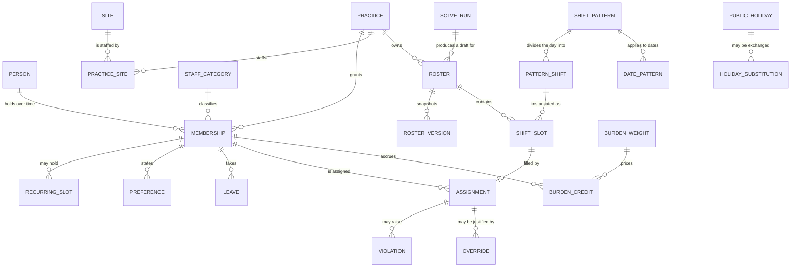

# Data model

The invariants here are the ones that must not be expressible as bugs. Where an invariant can live
in the database, it lives in the database — that is where it cannot be bypassed by a code path
somebody wrote in a hurry.

---

## Entity relationships



### Why `Person ↔ Membership ↔ Practice ↔ Site` and not `user.practice_id`

**One doctor may hold privileges at several hospitals and belong to several practices.** That is a
real property of South African private practice, not future-proofing. A `practice_id` column on a
user makes the second practice a data-modelling emergency.

The `Practice ↔ Site` relationship is many-to-many for the same reason: a practice may staff more
than one hospital, and a hospital hosts many practices. The hospital is a *consumer* of rosters,
never their owner.

`STAFF_CATEGORY` exists as a first-class entity because the practice **may** also roster genuinely
employed staff — practice manager, admin, nurses — to whom BCEA rules would apply while they do not
apply to the doctors. Whether it does is `[UNKNOWN]` and is logged. Modelling it now costs one table;
retrofitting it means every rule evaluation changes shape.

---

## Temporal model

Doctors join and leave, anchor slots transfer, rules change mid-year. This is textbook
**application-time temporal** data, and Postgres 18 ships native support for it.

```sql
CREATE EXTENSION IF NOT EXISTS btree_gist;

CREATE TABLE practice_membership (
  id         uuid PRIMARY KEY DEFAULT gen_random_uuid(),
  tenant_id  uuid      NOT NULL,
  doctor_id  uuid      NOT NULL,
  valid_at   daterange NOT NULL,
  -- ⚠️ NO `fte`, and it must not come back. DROPPED 2026-09-07 on the owner's answer to
  -- question 36, before the first migration ever ran. No doctor here works full time,
  -- including the principal, so there is no baseline to take a fraction of — and the column
  -- sat one line from the burden ledger, where `burden ÷ FTE` is the trap ADR-0012 exists to
  -- name. It was already gone from the solver contract in 1.1.0. A column that can only be
  -- misused is worse than no column. ADR-0008 still shows it, deliberately: an ADR is a
  -- record of a decision at a date, not a live schema.
  --
  -- No native `WITHOUT OVERLAPS` primary key: that is PostgreSQL 18, and the host (Supabase)
  -- offers 17 — see the addendum to ADR-0008. A GiST exclusion constraint gets the same
  -- overlap-prevention guarantee on 17.
  EXCLUDE USING gist (tenant_id WITH =, doctor_id WITH =, valid_at WITH &&)
);

CREATE TABLE shift_assignment (
  id         uuid PRIMARY KEY DEFAULT gen_random_uuid(),
  tenant_id  uuid      NOT NULL,
  doctor_id  uuid      NOT NULL,
  period     tstzrange NOT NULL,
  -- No native `FOREIGN KEY (doctor_id, PERIOD period) REFERENCES ...` either — PG18 again.
  -- H-03 ("you can only be rostered while you are a member") is enforced instead by a
  -- `BEFORE INSERT OR UPDATE` trigger that checks the assignment's start date against
  -- practice_membership.valid_at. See supabase/migrations/0004_roster_and_assignment.sql and
  -- the ADR-0008 addendum for exactly what that trades away.
  EXCLUDE USING gist (doctor_id WITH =, period WITH &&)
);
```

Two invariants earned here, both at the database level:

- **H-03 is enforced by a trigger, not a native temporal foreign key**, and the practical
  effect is the same — *"you can only be rostered while you are a member"* cannot be violated by
  any application code path. It is a weaker guarantee than a constraint in one specific sense (a
  trigger can be disabled by a superuser; a constraint cannot be bypassed short of dropping it),
  named explicitly in the ADR-0008 addendum rather than glossed over.
- **The exclusion constraint makes double-booking impossible**, natively, on the Postgres version
  actually in use. *"No doctor works two overlapping shifts"* is the single most important
  invariant in the system, and it belongs where it cannot be bypassed.

This is also why Postgres is not negotiable. A document database with no range types and no
exclusion constraints cannot express either invariant, and would push both into application code
where they will eventually be wrong.

### Notes and limitations

- **This schema targets PostgreSQL 17, not 18** — the host (Supabase) doesn't offer 18 yet. So it
  uses the `EXCLUDE USING gist` form throughout rather than native temporal primary/foreign keys;
  see the ADR-0008 addendum for what that costs and where the swap-over point is.
- **PostgreSQL 19 adds `FOR PORTION OF`** — temporal `UPDATE`/`DELETE` that splits rows
  automatically, which is exactly the *"this rule changed in March"* operation in one statement.
  Managed hosts typically trail major releases by months. **Design so adopting it later is a trivial
  migration**, and hand-roll the splits until then. Confirming the GA date and host availability is
  an open research item — see [`../ops/environments.md`](../ops/environments.md).
- **Do not go full bitemporal.** Transaction time — *when we learned* a fact — is what the audit log
  is for. Full bitemporality doubles query complexity and a solo developer will regret it.

### Published rosters are immutable snapshots

When a roster publishes, write a frozen `roster_version` row alongside the live editable
assignments. *"What was published"* and *"what is current"* are different questions, and conflating
them is the classic rostering bug. Editing creates version N+1; it never mutates N.

Versions are **hash-chained** so tampering is detectable.

---

## Shift patterns are per-date

```sql
-- The weekday supplies a default; any date can override it.
CREATE TABLE date_pattern (
  tenant_id  uuid NOT NULL,
  on_date    date NOT NULL,
  pattern_id uuid NOT NULL REFERENCES shift_pattern(id),
  reason     text,                    -- 'holiday', 'thin staffing', admin note
  PRIMARY KEY (tenant_id, on_date)
);
```

A date with no row uses its weekday default. A date with a row overrides it, and a date may
alternatively carry a fully custom shift set. See
[`../domain/shift-patterns.md`](../domain/shift-patterns.md) for the precedence order.

**Recurring structures use the iCal model — master row plus RRULE plus exceptions — and are never
materialised as rows.** Expand at solve time and render time; cache aggressively. *"This and all
future"* means splitting the series.

---

## Fairness

```sql
CREATE TABLE burden_weight (
  tenant_id   uuid      NOT NULL,
  shift_kind  text      NOT NULL,
  weight      numeric   NOT NULL,
  valid_at    daterange NOT NULL,
  PRIMARY KEY (tenant_id, shift_kind, valid_at WITHOUT OVERLAPS)
);

CREATE TABLE burden_credit (
  id            uuid PRIMARY KEY,
  tenant_id     uuid    NOT NULL,
  doctor_id     uuid    NOT NULL,
  roster_id     uuid    NOT NULL,
  shift_kind    text    NOT NULL,
  weight_used   numeric NOT NULL,   -- denormalised on purpose
  credited_at   timestamptz NOT NULL DEFAULT now()
);
```

`weight_used` is denormalised deliberately. When weights change, historical credits must keep the
weight that was in force when they were earned — recalculating history under new weights would
silently rewrite who owed what, which is the one number in this system nobody will forgive being
wrong. Weight changes apply **forward only**.

---

## Audit log

The audit trail is the product's legal spine, not a debugging aid.

Under ECTA s15(4), business records in data-message form are **rebuttable proof of the facts they
contain** in civil, criminal, administrative and disciplinary proceedings; s15(3) makes evidential
weight a function of demonstrable integrity. No law requires a roster to be signed, so an advanced
electronic signature is not needed — an authenticated click-to-approve with a timestamp is legally
sufficient.

To actually earn that evidential weight:

- **Append-only, immutable** record of every mutation: actor, timestamp, before, after, reason.
- **Hash-chained published versions.**
- **Immutable published snapshots** — edits create N+1, never mutate N.
- **MFA on sign-off.**
- **Override records preserved**, never cleaned up.
- **Server-side time, never client clocks.**

In a medico-legal enquiry, *"who was the on-duty EC doctor at 02:40 on 14 March"* is a question this
system should answer with an unrebuttable record. That is simultaneously a compliance feature and the
best differentiator available against a WhatsApp group.

---

## Multi-tenancy

**Shared schema + `tenant_id` + row-level security.** Every tenant-scoped table carries
`tenant_id`; RLS policies enforce isolation; `tenant_id` leads every composite index.

Rejected: schema-per-tenant, which turns every migration into a partial-failure loop; and
database-per-tenant, which is unoperable by one person. See
[ADR-0007](decisions/0007-shared-schema-rls.md).

## The `solve_run` queue

```sql
CREATE TABLE solve_run (
  id              uuid PRIMARY KEY,
  tenant_id       uuid NOT NULL,
  roster_id       uuid NOT NULL,
  status          text NOT NULL,     -- queued | running | succeeded | timed_out | failed
  request         jsonb NOT NULL,    -- validated against the solver contract
  best_objective  numeric,           -- updated live by the solution callback
  result          jsonb,
  claimed_at      timestamptz,
  finished_at     timestamptz
);
```

Claimed with `FOR UPDATE SKIP LOCKED`. The solution callback updates `best_objective` as CP-SAT
improves, which is what the client's progress bar subscribes to. `request` and `result` are
validated against [`solver-contract.md`](solver-contract.md) on both sides.

## Data the system must never hold

- **Patient-identifiable data of any kind.**
- **Health information about a doctor** — no leave *reasons*, no medical certificates, no fatigue or
  wellness self-reporting, no "unfit to work" flags. Each would make the system a processor of
  special personal information under POPIA s26.
- **Free-text preferences** — they reliably collect religious observance, which is also special
  personal information.

Enforced in validation, not only in the schema. See [`../ops/compliance.md`](../ops/compliance.md).
