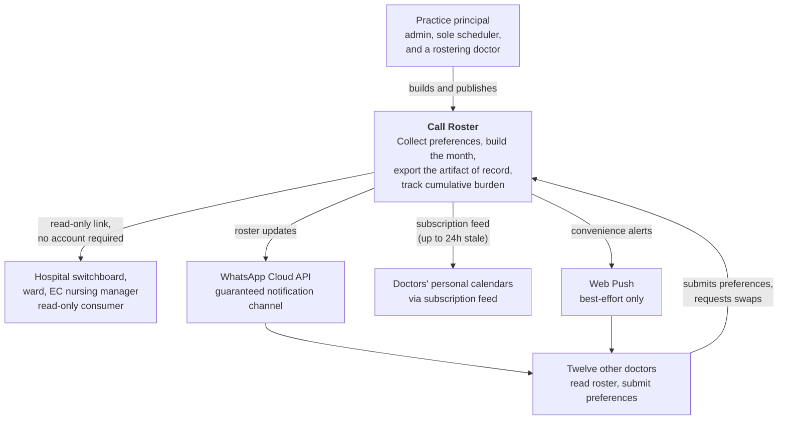
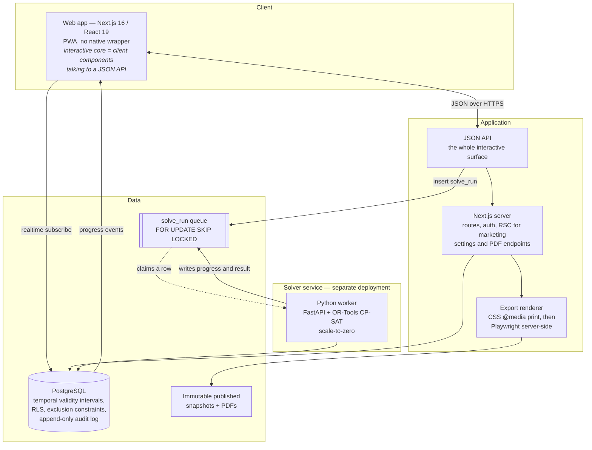

# Architecture overview

C4 Level 1 and Level 2 as Mermaid flowcharts. **Never Level 3** — component diagrams go stale
within a week and the code is the better source.

Mermaid's `C4Context` syntax is deliberately not used: it has been experimental for years and
renders poorly. Ordinary `flowchart` with subgraphs is clearer and renders everywhere.

---

## Quality goals, in priority order

Ordered, because when two conflict the higher one wins.

| # | Goal | Why it ranks here |
|---|---|---|
| 1 | **Correctness of the published roster** | A wrong roster means nobody is in the emergency centre. This outranks everything |
| 2 | **Auditability** | "Who was the on-duty doctor at 02:40 on 14 March" must have an unrebuttable answer |
| 3 | **Export fidelity** | The export is the product. If it looks wrong the system is abandoned |
| 4 | **Trust and explainability** | A solver nobody trusts is worse than no solver |
| 5 | **Solo maintainability** | One developer. Boring, conventional, few moving parts |
| 6 | **Data residency and privacy** | POPIA, and hospital procurement will ask |
| 7 | **Performance** | A month is ~1,600 booleans. Never the binding constraint |

Note that performance is last. This is a small problem wearing a scary name.

---

## Level 1 — System context

Two things this diagram is making explicit:

- **The hospital is downstream.** It consumes the roster and never owns it, because South African
  private hospitals cannot employ doctors. Every US enterprise product in this space assumes the
  opposite, and that assumption drives their whole data model.
- **WhatsApp is a first-class channel, not a nice-to-have.** It is the channel that actually gets
  read in South Africa, no incumbent does it, and push notification is too unreliable on iOS to
  carry anything time-critical.

---

## Level 2 — Containers

### Why the solver is a separate service behind a queue

Three independent reasons, any one sufficient:

1. **OR-Tools CP-SAT is Python.** No credible TypeScript solver exists at this problem's shape.
2. **The workload is idle 99% of the time, then pegs a CPU for up to 90 seconds.** That is exactly
   what scale-to-zero suits, and exactly what a request/response web process does not.
3. **A solve must never be a synchronous HTTP request.** Submit → subscribe → result. Insert a
   `solve_run` row; the worker claims it with `FOR UPDATE SKIP LOCKED`; CP-SAT runs with a time
   budget and a solution callback writing the intermediate best objective back to the row; the
   client subscribes and renders progress.

**Postgres is a correct, race-free job queue at this scale.** Redis, Inngest and Trigger.dev are
not needed, and none of them run a Python task natively anyway.

See [ADR-0004](decisions/0004-or-tools-cp-sat.md) and
[ADR-0005](decisions/0005-solver-as-python-service.md).

### Why the interactive core is client components against a JSON API

Not an accident, and not a preference about Server Actions. The grid must be a client component
regardless, so building the rest of the interactive surface the same way costs almost nothing —
and it means the whole interactive core could lift into a Vite SPA inside a Capacitor shell
**without a rewrite** if a native app ever becomes necessary.

Server Components are used where they are genuinely better: marketing pages, auth, settings, and
the PDF endpoints. See [ADR-0009](decisions/0009-pwa-first-no-native-wrapper.md).

---

## Solution strategy

| Concern | Approach | Reference |
|---|---|---|
| Roster matrix UI | Custom CSS Grid, ~400–600 lines. Zero licensing exposure | [ADR-0006](decisions/0006-custom-css-grid.md) |
| Doctor-facing calendar views | An MIT-licensed event calendar — those genuinely *are* events | [ADR-0006](decisions/0006-custom-css-grid.md) |
| Multi-tenancy | Shared schema + `tenant_id` + row-level security | [ADR-0007](decisions/0007-shared-schema-rls.md) |
| Change over time | Temporal validity intervals, not soft deletes | [ADR-0008](decisions/0008-temporal-validity-intervals.md) |
| Recurring structures | iCal model — master + RRULE + exceptions. Never materialised rows | [`../domain/shift-patterns.md`](../domain/shift-patterns.md) |
| PDF | CSS `@media print` first, then the identical stylesheet server-side | [`../product/prd.md`](../product/prd.md) |
| Auth | Magic links for doctors, TOTP/passkeys for admin | |
| Drag-and-drop | Only as an accelerator; click is the primary path | [`../product/prd.md`](../product/prd.md) |

## The riskiest boundary

**The TypeScript ↔ Python contract.** Two languages, two repositories' worth of types, and either
side can drift from the other without a compile error anywhere. Nothing else in this system can
break silently in that way.

Mitigation is a single source of truth —
[`solver-contract.md`](solver-contract.md) — with types generated from it on **both** sides.

## Deployment shape

| Component | Where | Note |
|---|---|---|
| Web app | Managed Next.js host | |
| Solver worker | Scale-to-zero container host | Idle cost near zero |
| Postgres | **Must be a South African region** | POPIA residency expectation, and hospital procurement treats it as a de facto requirement. **Confirming this is the top open technical question** — see [`../ops/environments.md`](../ops/environments.md) |
| Exports | Object storage, immutable | |

Estimated infrastructure cost at 15 users: roughly **$30–45/month**, with zero UI component
licensing.

**Where the real privacy leak is, and it is not the database:** it is the **sub-processors** — error
tracking with names in the payload, SMS gateways, email providers, log aggregation, support tooling.
Each of those is a cross-border transfer. Maintain a sub-processor register from day one and scrub
personal information from logs and error payloads. See
[`../ops/compliance.md`](../ops/compliance.md).
