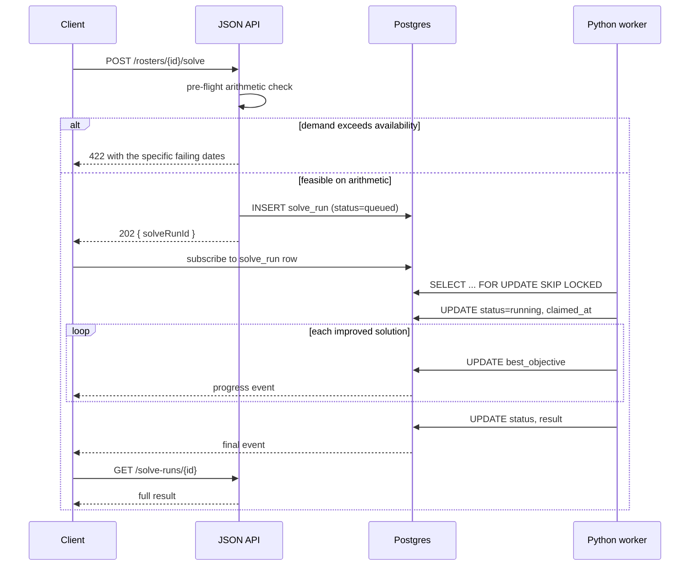

# Solver contract

**The single source of truth for the TypeScript ↔ Python boundary.**

This is the highest-risk interface in the system: two languages, and either side can drift from the
other without a compile error anywhere. Nothing else here can break silently in that way.

**Generate types from this document on both sides** — Zod schemas for TypeScript, Pydantic models
for Python. Neither side hand-writes the shapes. When the contract changes, both sides regenerate
in the same change, and the version field below is bumped.

**Not yet built.** Both sides currently hand-write their shapes, which is the drift this document
exists to prevent — tracked in `HANDOFF.md`. The one part that *is* enforced today is the weekday
representation, because that one is already actively wrong in both languages: see
[`lib/contract/weekday.ts`](../../lib/contract/weekday.ts) and `solver/src/call_roster_solver/wire.py`.

---

## The solve cycle



**Never a synchronous request.** The pre-flight check runs before anything is enqueued, because
*"you need one more doctor available on 23 November"* is worth far more than a solver timeout.

---

## Request

```jsonc
{
  "contractVersion": "1.7.0",
  "solveRunId": "uuid",
  "tenantId": "uuid",
  "rosterId": "uuid",

  "horizon": { "start": "2026-09-01", "end": "2026-09-30" },

  // Time budget. The solver returns its incumbent best when this expires.
  "timeBudgetSeconds": 30,

  "doctors": [
    {
      "code": "D01",                    // never a real name — see README data boundary
      "availableFrom": "2024-01-01",    // membership validity interval
      "availableUntil": null,
      "staffCategory": "independent_practitioner",
      // H-12, 1.5.0. Their agreed monthly ceiling. Absent means none, which is the common
      // case — most doctors here have no ceiling at all.
      "maxShiftsPerMonth": 4
      ,
      // H-11, 1.6.0. Day-class x shift-kind cells this doctor does not work, and a cap on
      // shifts inside one weekend. Both ELASTIC — "warn and scar, never block" — and both
      // absent for most doctors.
      "cannotWork": [{ "dayClass": "saturday", "shiftKind": "morning" }],
      "maxShiftsPerWeekend": 1
      // NO "fte" — see "The field that is not here" below. It cannot be defined for this
      // practice, and it sits one line away from fairness, which is where it would be misused.
    }
  ],

  // One entry per date. The pattern is a property of the date, not the weekday.
  "days": [
    {
      "date": "2026-09-04",
      "patternId": "friday",
      "isPublicHoliday": false,
      // kind is REQUIRED and is not derivable from the times — see below.
      "shifts": [
        // burdenWeight is resolved by the SENDER from its own burden schedule — 1.3.0.
        { "shiftId": "fri-early",   "kind": "morning",   "start": "07:00", "end": "12:00", "burdenWeight": 1.0 },
        { "shiftId": "fri-midday",  "kind": "afternoon", "start": "12:00", "end": "17:00", "burdenWeight": 1.0 },
        { "shiftId": "fri-evening", "kind": "evening",   "start": "17:00", "end": "23:00", "burdenWeight": 1.0 },
        { "shiftId": "fri-night",   "kind": "night",       "start": "23:00", "end": "07:00", "endsNextDay": true, "burdenWeight": 2.5 }
      ]
    }
  ],

  // Standing facts about where a doctor IS. H-10. NOT preferences — see below.
  "availability": [
    {
      "doctorCode": "D06",
      "rules": [
        {
          "kind": "NO_WEEKDAY_BEFORE",
          "hour": 17,
          "exceptWeekdays": ["MONDAY"]   // names, never integers — see below
        }
      ],
      // How the rule was arrived at, so the UI can show its strength rather than assert it.
      "derivedFrom": { "shiftsObserved": 214, "contradictions": 2 }
    }
  ],

  "preferences": [
    {
      "doctorCode": "D06",
      "type": "UNAVAILABLE",           // UNAVAILABLE | PREFER_NOT | PREFER | MUST
      "tentative": false,              // the diary's ± modifier
      "dates": ["2026-09-23", "2026-09-30"],
      "shiftIds": null,                // null = whole day
      "sourceToken": "NOT"             // provenance; see domain/preferences.md
    }
  ],

  "recurringSlots": [
    {
      "doctorCode": "D01",
      "weekday": "TUESDAY",
      "shiftId": "std-morning",
      "validFrom": "2024-01-01",
      "validUntil": null
    }
  ],

  // S-09, added in 1.7.0. Historical share of a slot with NO dominant holder — the 68%
  // of the roster S-05 cannot see. The solver turns `share` into a [floor, ceil] interval
  // over the month's occurrences of that slot, so 0.38 over four Saturdays means "one or
  // two, free; zero or three, priced".
  // ⚠️ NEVER for a slot that also appears in `recurringSlots`. S-05 and S-09 partition the
  // slots between them and both sides of the wire refuse the overlap.
  "slotShares": [
    {
      "doctorCode": "D01",
      "weekday": "SATURDAY",
      "shiftId": "std-morning",
      "share": 0.38          // in (0, 1]
    }
  ],

  // Cumulative balances BEFORE this month. The whole point of the ledger.
  // `entitlement` is the burden of what they COULD have worked over the SAME span — the
  // denominator, and since 1.3.0 that span INCLUDES this month. See below.
  //
  // `holidayBurden` / `holidayEntitlement` are S-08's, added in 1.4.0, and run over a
  // TWELVE-month span rather than S-01's three — the principal asked for public holidays
  // to be shared "throughout the year", and a year holds only ~44 holiday slots.
  // ⚠️ Both or neither: one alone is a burden over a denominator covering a different
  // span, which reads as a large imbalance and gets acted on. The parser refuses it.
  "burdenLedger": [{
    "doctorCode": "D01", "cumulativeBurden": 142.5, "entitlement": 149.6,
    "holidayBurden": 8, "holidayEntitlement": 36
  }],

  // ⚠️ SUPERSEDED by shifts[].burdenWeight in 1.3.0 and no longer read by the solver.
  // Retained for reporting; removal is a 2.0 change.
  "burdenWeights": { "weekday_day": 1.0, "weekday_night": 2.5,
                     "saturday": 3.0, "sunday": 3.5, "public_holiday": 5.0 },

  // Enabled constraints with their mode and weight. Rules are DATA, not code.
  "constraints": [
    { "id": "H-01", "mode": "BLOCK", "weight": 1000000 },
    { "id": "H-04", "mode": "BLOCK", "weight": 10000 },
    { "id": "H-07", "mode": "OFF",   "weight": 10000 },
    { "id": "S-01", "mode": "WARN",  "weight": 100 },
    { "id": "S-06", "mode": "WARN",  "weight": 80 }
  ],

  // Cells the admin pinned, and the previous published roster for churn penalty.
  "lockedAssignments": [{ "date": "2026-09-25", "shiftId": "std-night", "doctorCode": "D13" }],
  "previousPublished":  [{ "date": "2026-09-01", "shiftId": "std-morning", "doctorCode": "D01" }],

  // H-12's floor, 1.5.0. ⚠️ Absent means no floor, and a solve without one lets S-01 starve
  // whoever is over their cumulative fair share all the way to zero.
  "monthlyMinimumShifts": 2
}
```

**`H-07` is shipped with `mode: "OFF"` on purpose.** It is `[INFERRED]`, not confirmed — see
[`../domain/constraints.md`](../domain/constraints.md). The contract carries the mode so that
turning it on is a configuration change, never a code change.

**And note H-07 is scoped to Pattern B, not to Fridays.** It was originally written against the
weekday and the primary source falsified it — D01 worked a Friday that was running Pattern C. Any
constraint whose real subject is the shift structure must be written against `patternId` or the
shift IDs, never against `weekday`, or it misbehaves on exactly the days the pattern changes. H-06
has always been written correctly this way; H-07 now matches. See
[`../domain/worked-examples.md`](../domain/worked-examples.md).

---

### `shifts` are sent per date, and the solver must use them

Added `kind` in **1.1.0**, and fixed something worse than a missing field: **the solver was ignoring
this array entirely.**

`Day.shifts` read from a module-global `PATTERNS` table keyed by `patternId`, holding the pilot
practice's three patterns. So the contract sent the shifts, the solver looked up its own, and the two
agreed only because there is exactly one practice. A second tenant with a four-shift Saturday would
have silently been rostered on this practice's times — the single-tenant leak
[ADR-0010](decisions/0010-productisation-seams-first.md) exists to prevent, in the one place where
"we will generalise later" is least survivable.

`Day.explicit_shifts` now carries the payload's shifts and `contract.py` always populates it. The
table survives **only** as a fixture convenience so `september_2026()` and 41 tests need not restate
three shifts apiece, and its docstring says so.

**`kind` is required, and is not derivable from the times.** It is what makes a shift a *night* —
`Shift.is_night`, which drives H-04's back-to-back-nights rule and burden classification. Inferring
it from `endsNextDay` happens to work for all three current patterns and is still wrong: that is a
coincidence of this practice's hours, not a definition, and the first pattern that breaks it would
break H-04 silently rather than loudly. Valid values are the five `ShiftKind` members: `morning`, `afternoon`, `evening`, `night`,
`long-day`.

**That list was seven members until 1 September 2026, and the two sides disagreed on it** — the sixth
mismatch, and the same class of bug as the weekday integers. Python held `fri_early`, `fri_midday`,
`fri_evening` and spelled the long day `long_day`; TypeScript held `evening` and `long-day`. A
TypeScript-built request would have been rejected outright on `long-day`, which is the good case; the
bad case is `fri_evening`, which Python applied to **Pattern C's evening shift** — and a Pattern C day
is not a Friday.

The TypeScript vocabulary won because it is the correct one. The glossary defines the burden axis as
*"day class × shift kind"*, so `kind` is a **burden** concept; `fri_early` describes a *position in a
pattern*, which is what `shiftId` and `patternId` already say. Six of Python's seven members earned
nothing either — the only consumer is `is_night`.

Fixing it also fixed a visible bug: the solver's debug grid hard-coded rows for
`morning`/`afternoon`/`night`, so it silently dropped three of Friday's four shifts. Rows are now
derived from the kinds present.

A boundary with a non-zero minute is **rejected, not rounded** — rounding a shift boundary changes who
is on duty. And a shift whose end is at or before its start must set `endsNextDay`, or 23:00–07:00
parses as a shift of minus sixteen hours and the burden arithmetic quietly goes negative.

### Reading a request: `contract.py`

`parse_request` is the Python entry point, and until 1.1.0 it did not exist — the only way to obtain
an `Instance` was the `september_2026()` fixture. **So this document described a payload that nothing
could read, and every field in it was unverified by construction.** Three of the five problems fixed
in 1.1.0 were found by writing the parser.

Four rules it follows, all of them from this document:

1. **Unknown fields are rejected everywhere**, not only at the top level. A field the sender believes
   is honoured and the receiver silently drops is the worst failure available here: it surfaces as a
   wrong roster, months later, in another language.
2. **Weekdays arrive as names.** See above.
3. **Shifts come from the payload**, never the pattern table.
4. **No silent default for anything semantic.** An absent optional with an obvious default
   (`tentative`, `endsNextDay`) defaults; an absent required field raises. There is no third
   category, because "sensible default" is how a roster gets built on the wrong assumption.

Errors carry the JSON path — `availability[0].rules[0].kind` — because *"invalid request"* is not
actionable and this payload has sixteen top-level fields.

**Parsing is never partially applied.** Either the whole request is trustworthy or no `Instance` is
built.

`lockedAssignments` is **validated but not yet consumed** by the model. Checked rather than ignored,
so that the day the model does consume it the shape is already proven. **`previousPublished`,
`burdenLedger` and `burdenWeights` were all in that list until 2 September 2026** — S-06 reads the
first and S-01 the other two.

### `burdenLedger.entitlement`, added in 1.2.0, and why it is not optional

**A cumulative burden divided by a single month's opportunity share is dimensionally wrong.** The
first S-01 implementation did exactly that — a 33-month numerator over a one-month denominator — so a
doctor who joined recently carried almost nothing against a full month's share, read as enormously
under-loaded, and the solver handed them the month. The result was a roster further from the
practice's habits on every axis than any real month in three years.

So `entitlement` travels beside `cumulativeBurden` and spans the same period: the burden of
everything that doctor **could** have worked, per
[ADR-0012](decisions/0012-fairness-normalised-by-opportunity.md). Never headcount, never FTE — a
weekends-only doctor works nothing but expensive shifts, so a per-head divisor reports them as
overloaded and the objective takes away the only work they can do.

**Computed on the TypeScript side** by `entitlementWeights`, deliberately: it is one implementation
of `revealed-opportunity`, and a second in Python is the silent divergence this document exists to
prevent.

⚠️ **`burdenWeights` is coarser than the ledger's own schedule, knowingly.** Five flat keys cannot
express Christmas night at 8.0 or a Pattern C long day at 1.5, so the solver prices them at 5.0 and
1.0 — 2 nights and 14 long days in 33 months. The fix is a resolved per-slot weight on the wire,
which would delete the second implementation rather than align it. Not done.

`previousPublished` has one rule the other sections do not: **its `doctorCode` is not validated
against this request's `doctors`.** A roster published before a departure legitimately names someone
who has left, and rejecting it would make the last month before any departure unparseable. The model
skips a ref whose doctor or slot no longer exists rather than penalising a move nobody could avoid.
Two refs for the same `(date, shiftId)` **are** refused — the published roster had one doctor per
slot, and silently keeping the last would make the churn penalty quietly wrong rather than loudly
absent.

**`constraints[].weight` is deliberately not applied.** Modes are read — that is the point of shipping
H-07 as `OFF` — but a per-request weight override would let a caller reorder the tier hierarchy, and
that hierarchy *is* the safety property. Weights live in the penalty registry.

**This is why the churn control is on/off rather than a dial.** `docs/domain/constraints.md` asks for
churn as a *"how much can it rearrange?"* control; what `mode: "OFF"` gives is the coarsest version of
it. A graduated dial needs a **bounded in-tier** weight on the wire — bounded so it cannot lift a
preference above a contract limit — which is a contract change, not a model change. Not built, and
deliberately not faked with an unbounded `weight`.

---

### `availability` is not a preference, and the distinction is the whole point

Added in **1.1.0**. Until then H-10 existed in the solver's own dataclass and in
[`lib/analytics/availability.ts`](../../lib/analytics/availability.ts), but **had no wire
representation** — so in a running system the solver could never have been told about it.

The obvious workaround is the trap. Encoding *"D06 cannot work weekday mornings"* as a
`type: "UNAVAILABLE"` preference for every affected date is wrong three times over:

1. **It consumes the preference budget.** H-08 declarations are budgeted on purpose, because unpriced
   declarations inflate until the model jams for reasons nobody can see. A doctor who is simply *at
   another practice* would spend their entire allowance on a fact they never chose.
2. **It requires enumerating every date**, so the fact silently expires at the end of the horizon.
3. **It loses the public-holiday exemption.** Pool doctors work daytime shifts on holidays — their own
   practices are closed — and a date-enumerated preference has nowhere to express that.

So:

| | H-08 `preferences` | H-10 `availability` |
|---|---|---|
| What it is | a doctor **declaring** a wish for a date | a standing **fact about where they are** |
| Varies by date | yes | no |
| Budgeted | yes | no |
| Holiday behaviour | as declared | **exempt, intrinsically** |
| Tier | PREFERENCE 10⁰ (or LEGAL if `MUST`) | **COVERAGE 10⁶ × 2** |

**H-10 is priced deliberately above a coverage shortfall.** A doctor at another practice and an empty
slot both leave nobody in the building, but they are not equally bad: an empty slot is visible and
tells the principal he has a problem, while a phantom doctor produces a roster that **looks complete
and is not**. Given the choice the model leaves the gap showing.

`derivedFrom` carries the evidence, not a confidence score. `inferAvailability` reproduces the
practice's own anchor/pool split from assignments alone, and the UI should be able to say *"never
seen on an early weekday in 214 shifts"* rather than asserting a rule the admin cannot check.

### ⚠️ A weekday NEVER crosses this boundary as an integer

**The two sides number the days differently and both are correct.**

| | | `MONDAY` | `SUNDAY` |
|---|---|---|---|
| TypeScript | `Date.getUTCDay()` | **1** | **0** |
| Python | `date.weekday()` | **0** | **6** |

Neither can reasonably change — each matches its own standard library. So the same concept, *"the
Monday exception on D07's availability rule"*, is `1` on one side and `0` on the other. Sent as an
integer it **silently becomes Sunday on arrival**, and nothing raises an error anywhere: the roster is
merely wrong, on the one day of the week nobody was looking at.

This is exactly the silent drift this document opens by naming as the highest risk in the system, and
it is already live in two structures — `availability[].rules[].exceptWeekdays` and
`recurringSlots[].weekday`.

**So the wire type for a weekday is a name**, and each side converts exactly once, in one place:

- [`lib/contract/weekday.ts`](../../lib/contract/weekday.ts)
- `solver/src/call_roster_solver/wire.py`

Both modules reject an unknown name rather than defaulting, and both reject an out-of-range integer —
Python's negative indexing would otherwise turn `-1` into `SUNDAY` without complaint. Their tests
**pin the asymmetry on purpose**: `weekday.test.ts` asserts `MONDAY === 1` and `test_wire.py`
asserts `MONDAY == 0`, so anyone "fixing" either side to agree with the other breaks a build.

The original contract already got this right for `recurringSlots` with `"weekday": "TUESDAY"`. That
was a convention one field happened to follow; it is now a rule with an enforcement mechanism.

### The field that is not here: `fte`

`fte` was in 1.0.0 and is **removed in 1.1.0**, because it cannot be defined for this practice.

The principal confirmed that **no doctor on this roster works full time here, including himself** —
every one of them holds another practice, another hospital, or both. There is therefore no full-time
baseline from which a fraction could be taken, and any number in that field would be invented.

It also sat one line from `burdenLedger`, which is precisely where it would have been misused.
[ADR-0012](decisions/0012-fairness-normalised-by-opportunity.md) is explicit that **burden ÷ FTE is
the trap, not the fix**: FTE captures how *much* a doctor works and says nothing about the *mix*, so
it leaves a weekends-only doctor looking chronically overloaded. Fairness is normalised by the burden
of a doctor's **opportunity set**, which needs `availability` — now present — and nothing else.

The column still exists in `doctors` in [`data-model.md`](data-model.md). Removing it there is a
schema decision, logged as a question rather than taken unilaterally.

---

## Response

**⚠️ The shape below is the target, and has never actually been built** — checked 2026-09-08 while
working on solve-run diagnostics (`docs/DECISIONS.md`). What exists today is a different,
overlapping debug shape: `call-roster-solver --request ... --json`
(`solver/src/call_roster_solver/__init__.py`), consumed by `scripts/check-solver-e2e.ts`. It has a
flat `objective` rather than `{total, byTier}`, no `contractVersion`/`solveRunId`, and extra debug
fields (`preflightOk`, `slots`, `doctors`, `days`) this document doesn't mention. Building the real
response-assembly function is real, separate work — the natural companion to `GenerateDraft`, which
also doesn't exist yet.

```jsonc
{
  "contractVersion": "1.7.0",
  "solveRunId": "uuid",

  // FEASIBLE | OPTIMAL | TIMED_OUT | ERROR.  Never "INFEASIBLE" — see below.
  "status": "FEASIBLE",
  "wallClockSeconds": 4.8,

  "assignments": [
    { "date": "2026-09-01", "shiftId": "std-morning", "doctorCode": "D01" }
  ],

  "objective": { "total": 1284, "byTier": { "coverage": 0, "legal": 0,
                                            "contract": 200, "preference": 1084 } },

  // Derived directly from the penalty registry. Every violation is attributable.
  "violations": [
    {
      "constraintId": "S-03",
      "entityRefs": { "doctorCode": "D09", "date": "2026-09-14", "shiftId": "std-night" },
      "slackValue": 1,
      "weight": 30,
      "cost": 30,
      "message": "D09 asked not to work 14 September but is assigned the night shift."
    }
  ],

  // Populated when coverage could not be met. This is the feasRelax framing.
  "relaxationOptions": [
    {
      "description": "Cover 16–18 September by asking one of these to work a night they declined",
      "candidates": ["D06", "D09", "D11"],
      "additionalCost": 90
    }
  ],

  "unfilledSlots": [],
  "ledgerAfter": [{ "doctorCode": "D01", "cumulativeBurden": 156.0 }]
}
```

### `status` never includes `INFEASIBLE`

Almost every constraint is elasticised with a named slack variable and an order-of-magnitude penalty
hierarchy — **10⁶ coverage · 10⁴ legal/rest · 10² contract · 10⁰ preference** — so the model always
returns something and reports what it had to break.

`ERROR` means the solver itself failed: a malformed request, a crash, a bug. It does not mean
"no solution".

This is what commercial solvers package as `feasRelax`, and it must be replicated deliberately here
because CP-SAT gives you nothing equivalent.

### `violations` comes from the penalty registry

Build the registry as the model is constructed — `(constraint_name, entity_refs, slack_var, weight)`
appended for every constraint added. The `violations` array is then a projection of it, and the cost
breakdown, the counterfactual mode and the infeasibility narrative all come for free.

**Retrofitting this is painful.** It is the single most important structural decision in the solver
code and it belongs in the first commit of it.

---

## Semantics

| Concern | Rule |
|---|---|
| **Timeout** | Return the incumbent best with `status: "TIMED_OUT"` and its objective. A timeout is a quality statement, not a failure |
| **Determinism** | **CP-SAT is not deterministic** across versions, `num_workers` or machines. Never assert on a specific roster; assert on properties. Snapshot the *model*, never the solution |
| **Churn** | Always re-solve with a penalty against `previousPublished`. A globally better but completely different roster is a product failure |
| **Idempotency** | The same `solveRunId` never runs twice. The worker claims a row exactly once |
| **Time zone** | All dates are practice-local; all timestamps are UTC on the wire. `endsNextDay` disambiguates overnight shifts |
| **Unknown fields** | Both sides **reject** unknown fields rather than ignoring them. Silent tolerance is how the two sides drift apart |

## Versioning

`contractVersion` is semver and is validated on both sides.

- **Patch** — documentation or comment only.
- **Minor** — a new optional field. The worker must accept a request without it.
- **Major** — anything else. Deploy the worker first, accepting both versions, then the app.

A worker receiving a major version it does not know **fails the run with `ERROR` and a clear
message**. It does not attempt a best-effort interpretation: a solver quietly ignoring a constraint
it did not understand is precisely the failure this whole document exists to prevent.

## Implementation notes

- Lift `negated_bounded_span`, `add_soft_sequence_constraint` and `add_soft_sum_constraint`
  essentially verbatim from OR-Tools' `shift_scheduling_sat.py`. They are the hard-won part.
- **Do not start from the simpler `employee_scheduling` tutorial** — its hard `AddExactlyOne`
  coverage is the number-one cause of "no solution found" in production.
- Model on the **regular-expression abstraction** rather than an enumerated rule list. See
  [`../domain/constraints.md`](../domain/constraints.md).
- The fairness phases run as a **lexicographic multi-phase solve**, warm-started with `add_hint`.
  Four sequential calls at n=13 is a few seconds. See
  [`../domain/fairness.md`](../domain/fairness.md).
