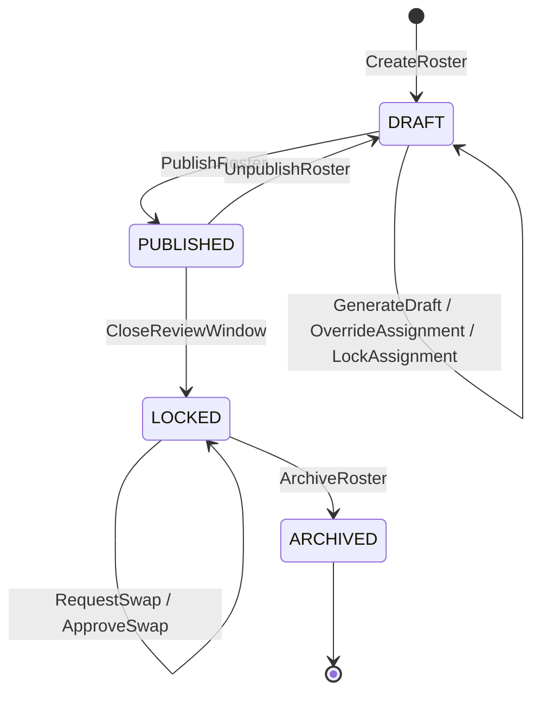

# Commands, events and policies

Output of a solo event-storming pass over the domain. The purpose is to name every operation
before any of them has a route, a table or a component — so that when they do, they are named
consistently.

Terms come from [`../product/glossary.md`](../product/glossary.md). If something here needs a word
that is not in the glossary, the glossary is wrong and should be fixed first.

**Convention:** commands are imperative (`PublishRoster`), events are past tense
(`RosterPublished`), policies are *"when X, then Y"*.

---

## The roster lifecycle

Four states, not two. The incumbent products effectively have two, which is what makes this a
genuine differentiator — and it matches what the principal independently asked for.

| State | Who sees it | What can change |
|---|---|---|
| `DRAFT` | Admin only | Anything. The generator runs freely |
| `PUBLISHED` | Everyone, read-only | Edits create a new version and notify |
| `LOCKED` | Everyone, read-only | Only through a swap transaction with an audit trail |
| `ARCHIVED` | Everyone, read-only | Nothing. Feeds the ledger |

**`UnpublishRoster` must emit a diff** of what changed. Going backwards silently is how people stop
trusting the system.

---

## Commands

### Personnel

| Command | Notes |
|---|---|
| `AddDoctorToPractice` | Opens a membership validity interval. Never creates a "user" without a membership |
| `EndDoctorMembership` | Closes the interval. **Not a delete** — sixteen months of history depend on the row |
| `AssignRecurringSlot` | (doctor, weekday, shift, validity interval). What makes an anchor |
| `TransferRecurringSlot` | Splits the series: truncate the incumbent's interval, open the successor's. The June 2026 handover |
| `EndRecurringSlot` | |

### Availability

| Command | Notes |
|---|---|
| `SubmitPreference` | Typed enum only. **Rejects free text** — enforced in validation, not just UI |
| `WithdrawPreference` | |
| `RecordLeave` | An **absence**, not a preference. Administrative category only, never a reason |
| `SetUnavailabilityBudget` | Per practice, per period |
| `OpenPreferenceWindow` / `ClosePreferenceWindow` | |

### Calendar shape

| Command | Notes |
|---|---|
| `SetDateShiftPattern` | Per-date override of the weekday default |
| `DefineCustomShiftSet` | Fully arbitrary shifts for one date |
| `DeclarePublicHoliday` | Ad hoc declaration. **Must trigger ledger recalculation** |
| `SubstituteHolidayForDoctor` | Public Holidays Act s2(2) exchange |

### Rostering

| Command | Notes |
|---|---|
| `CreateRoster` | For a practice and a month |
| `GenerateDraft` | Async. Enqueues a solve; never a synchronous request |
| `CancelSolve` | |
| `AssignDoctorToSlot` | Manual assignment. **The primary interaction** — the solver is last |
| `ClearAssignment` | |
| `OverrideAssignment` | Accepts a warned violation. Logs actor, timestamp, reason |
| `LockAssignment` | Pins a cell so a re-solve cannot move it |
| `PublishRoster` | **An event, not a save.** See below |
| `UnpublishRoster` | With a diff |
| `CloseReviewWindow` | → `LOCKED` |
| `RequestSwap` / `ApproveSwap` / `RejectSwap` | Post-lock change path |
| `ArchiveRoster` | |

### Rules and fairness

| Command | Notes |
|---|---|
| `SetRuleMode` | OFF / WARN / BLOCK, per rule, per practice, per staff category |
| `SetBurdenWeights` | Versioned with a validity interval. Never edits history |
| `RecalculateLedger` | Idempotent. Triggered by policy, also runnable by hand |
| `EnableRulePack` / `DisableRulePack` | Rule packs are data, not code |

### Distribution

| Command | Notes |
|---|---|
| `MintShareLink` | Scoped, expiring, revocable. **Minimal payload by default** — role, not phone number |
| `RevokeShareLink` | |
| `RegenerateIcsToken` | An ICS URL is a bearer credential. Treat it as one |
| `ExportPrintableGrid` | A4 landscape default, A3 option |
| `ExportWhatsAppImage` | Exactly 2048px wide — see [`../product/prd.md`](../product/prd.md) |

---

## Events

**Personnel:** `DoctorAddedToPractice` · `DoctorMembershipEnded` · `RecurringSlotAssigned` ·
`RecurringSlotTransferred`

**Availability:** `PreferenceSubmitted` · `PreferenceWithdrawn` · `PreferenceRejectedAsFreeText` ·
`UnavailabilityBudgetExceeded` · `LeaveRecorded` · `PreferenceWindowOpened` ·
`PreferenceWindowClosed`

**Calendar:** `DateShiftPatternChanged` · `CustomShiftSetDefined` · `PublicHolidayDeclared` ·
`HolidaySubstitutedForDoctor`

**Solving:** `SolveEnqueued` · `SolveStarted` · `SolveProgressed` · `SolveSucceeded` ·
`SolveTimedOut` · `SolveFailed` · `PreflightInfeasibilityDetected`

**Rostering:** `DraftGenerated` · `AssignmentChanged` · `AssignmentOverridden` ·
`ConstraintViolationRaised` · `RosterPublished` · `RosterUnpublished` · `ReviewWindowClosed` ·
`SwapRequested` · `SwapApproved` · `SwapRejected` · `RosterArchived`

**Fairness:** `BurdenCredited` · `BurdenWeightsChanged` · `LedgerRecalculated`

**Distribution:** `ShareLinkMinted` · `ShareLinkRevoked` · `IcsTokenRegenerated` ·
`PrintableGridExported`

Two worth calling out:

- **`PreferenceRejectedAsFreeText`** is an event on purpose. If it fires often, the enum is missing
  a category people actually need, and that is a product signal rather than a user error.
- **`PreflightInfeasibilityDetected`** fires *before* the solver runs. It is what lets the product
  say *"you need one more doctor available on 23 November"* instead of *"no solution found"*.

---

## Policies

> **When `RosterPublished`** → notify every doctor on their chosen channel; activate ICS feeds; mint
> the read-only share link; snapshot an immutable printable PDF; open the review window; write a
> `roster_version` row.

That is what "publish is an event, not a save" means concretely.

> **When `ReviewWindowClosed`** → transition to `LOCKED`; disable direct editing; route all further
> change through swaps.

> **When `SwapApproved`** → create version N+1, never mutate N; notify both doctors and anyone
> holding an active share link; bump the ICS `SEQUENCE`; recalculate the ledger.

> **When `LeaveRecorded`** and it overlaps a published roster → **flag the affected roster**, do not
> silently reassign. An unannounced change to a live call roster is a patient-safety event.

> **When `PublicHolidayDeclared`** → recalculate the ledger, because holiday burden weights differ
> sharply from ordinary ones.

> **When `BurdenWeightsChanged`** → recalculate **forward only**. Historical credits keep the weight
> in force when they were earned.

> **When `SolveTimedOut`** → return the incumbent best solution with its objective, never an error.
> A timeout is a quality statement, not a failure.

> **When `AssignmentOverridden`** → keep the warning visible on the grid as a permanent scar. It does
> **not** disappear because it was acknowledged. That is what gives soft constraints teeth without
> losing the audit trail.

> **When `DoctorMembershipEnded`** → their future assignments become violations to resolve, not
> silent deletions. The principal decides who covers.

> **When any mutation occurs** → append to the immutable audit log with actor, server timestamp,
> before/after and reason. **Server-side time, never a client clock.**

---

## Bounded contexts

| Context | Owns |
|---|---|
| **Rostering** | Roster, RosterVersion, Assignment, ShiftSlot, Constraint, Violation |
| **Availability** | Preference, Leave, UnavailabilityBudget, PreferenceWindow |
| **Personnel** | Person, Membership, RecurringSlot, StaffCategory |
| **Calendar** | ShiftPattern, DateOverride, PublicHoliday |
| **Fairness** | BurdenWeight, BurdenCredit, Ledger |
| **Distribution** | ShareLink, IcsFeed, Notification, Export |

Where the same word differs across contexts, say so explicitly. The known case: **Rostering's
`Assignment`** is a committed fact about who is on duty; **Availability's `Preference`** is a stated
wish. They are never the same object and there is no state transition between them — a preference is
input to a decision, not a provisional version of it.

## Not modelled, deliberately

- **Payroll, timesheets, clock-in.** There is no payroll for these doctors; they bill fee-for-service
  under a practice code. The useful output is a **shift-count report for internal fee-split**. Time
  and attendance is not merely irrelevant here, it is probably offensive to the user.
- **Patient data, of any kind, ever.**
- **Credentialing.** Real in the US enterprise products, out of scope here.
- **Self-assignment by doctors.** See [`fairness.md`](fairness.md) for the evidence.
